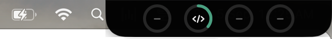

# Notchly

Your AI agents' limits, living in the notch.

Notchly is a tiny macOS app that draws a notch on the top-right edge of your screen and shows **live usage limits** for the AI tools you already use — Claude Code, Codex, Factory AI, and Gemini / Google AI Pro (Antigravity). Hover it to expand usage cards; right-click for settings.



## Providers

| Provider | How Notchly reads it | Setup |
|---|---|---|
| **Claude** | Anthropic's OAuth usage API, using the token Claude Code already stores in `~/.claude/.credentials.json` | Sign in to Claude Code once |
| **Codex** | Rate-limit windows recorded in local Codex rollout files (`~/.codex/sessions`) | Sign in to Codex and run it once |
| **Factory** | `api.factory.ai/api/billing/limits` with your API key; without a key it counts local droid sessions | Paste an API key from [app.factory.ai/settings/api-keys](https://app.factory.ai/settings/api-keys) in Settings |
| **Gemini / Google AI Pro** | Google Cloud Code quota API with each account's OAuth creds — one ring covers all your accounts | Sign in to Antigravity or Gemini CLI, then add each account's `oauth_creds.json` in Settings (all nine can live side by side) |

Notchly never asks for your password. It reads tokens from tools already signed in on your Mac and keeps everything local — nothing leaves your machine except the vendors' own usage calls.

## Install

1. Grab the latest `Notchly-*.dmg` from [Releases](../../releases).
2. Open it and drag **Notchly** into **Applications**.
3. Launch it. If macOS warns about an unidentified developer: right-click the app → **Open** → **Open** (the app is ad-hoc signed, so Gatekeeper wants one manual confirmation), or run:

```bash
xattr -cr /Applications/Notchly.app
```

4. A notch appears on the top-right edge. Hover it. That's the whole UI.

## Build from source

```bash
swift build -c release
```

Then assemble the bundle:

```bash
mkdir -p Notchly.app/Contents/MacOS
cp .build/arm64-apple-macosx/release/Notchly Notchly.app/Contents/MacOS/
codesign --force --sign - Notchly.app
```

Requires macOS 14+ and Swift 6.

## Privacy

- Credentials are read from each tool's own local files and are never sent anywhere except the vendor's usage endpoint.
- The Factory API key (optional) is stored in your login Keychain.
- No telemetry, no accounts, no servers.

## License

MIT
